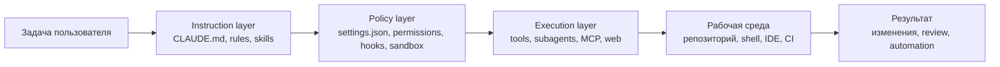
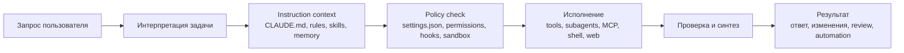

# Claude Code: управление субагентами, инструментами и автономной работой

> Версия файла: `v1.0`
> Дата версии: `2026-03-16`
> Тип документа: `структурированный прикладной гайд`
> Основание:
> - [claudecode_process_1.md](claudecode_process_1.md)
> - [claudecode-precess_2.md](claudecode-precess_2.md)
> - [claudecode_vs_codex.md](claudecode_vs_codex.md)
>

## О документе

Этот материал собран как прикладной гайд по `Claude Code` для тех, кто хочет не просто пользоваться агентом в чате, а осознанно управлять его поведением, уровнем автономности и архитектурой работы. Документ соединяет обзор ключевых механизмов `Claude Code` с практическими шаблонами настройки под реальную инженерную среду: локальную разработку, review, диагностику, релизы и controlled automation.

Связанная краткая версия: [`education/root_docs/cc_managment_readme.md`](cc_managment_readme.md).

## Короткая аннотация

Этот документ представляет собой практический гайд по устройству и управлению `Claude Code` как агентной среды разработки. Он объясняет, как в `Claude Code` организованы субагенты (`subagents`), встроенные и внешние инструменты (`tools`), уровни разрешений (`permissions`), хуки (`hooks`), навыки (`skills`), подключаемые серверы `MCP`, а также механизмы памяти и проектных инструкций (`CLAUDE.md`). Главная цель документа — показать, что `Claude Code` следует воспринимать не как обычный чат с моделью, а как управляемую систему исполнения, в которой поведение агента зависит от конфигурации, политик доступа, структуры проекта и набора подключенных инструментов.

## Расширенная аннотация

Документ нужен для того, чтобы помочь пользователю перейти от интуитивного и разрозненного использования `Claude Code` к осознанной, безопасной и воспроизводимой работе. В нем разбирается, какие механизмы отвечают за “мягкое” поведение агента, а какие задают реальные технические ограничения; где именно находятся основные файлы конфигурации; как проектировать собственных субагентов; когда стоит использовать `skills`, а когда — `hooks` или `MCP`; как ограничивать доступ к чувствительным данным; как организовывать controlled autonomy без риска случайных destructive actions, утечки секретов или бесконтрольных сетевых вызовов.

По сути, это документ о том, как превратить `Claude Code` в предсказуемого и полезного инженерного помощника. Он описывает не только отдельные функции, но и общую архитектуру управления: какие слои отвечают за инструкции, какие — за безопасность, какие — за расширяемость, и как все это комбинировать в реальной практике. Отдельное внимание уделено тому, как выстроить рабочую схему для локальной разработки, ревью, диагностики, подготовки релизов, CI/CD-сценариев и более автономных агентных workflows.

Документ будет полезен двум основным группам читателей. Первая — это разработчики и power users, которые хотят использовать `Claude Code` в ежедневной работе, но при этом понимать границы его автономности и контролировать критические действия. Вторая — это более продвинутые пользователи, которые хотят проектировать собственную агентную инфраструктуру: создавать subagents, настраивать permissions, подключать внешние сервисы через `MCP`, выстраивать hooks-политику и строить повторяемые инженерные процессы поверх `Claude Code`.

Внутри документа акцент сделан не на абстрактные рассуждения, а на практическое применение. Он показывает, какие сущности в `Claude Code` за что отвечают, в каких случаях использовать тот или иной механизм, как их правильно комбинировать и какие архитектурные ошибки лучше не допускать. Иными словами, это не просто описание возможностей платформы, а руководство по тому, как настроить `Claude Code` так, чтобы он работал надежно, безопасно и в соответствии с задачами конкретного пользователя или команды.

## Главные линии

Перед тем как переходить к конфигурации, полезно зафиксировать несколько базовых тезисов, вокруг которых построен весь документ.

1. `Claude Code` — это не просто чат с моделью, а управляемая агентная среда.
2. Поведение агента определяется не только prompt'ом, но и набором настроек, permissions, hooks, skills и project memory.
3. `CLAUDE.md` нужен для проектных правил и инженерного контекста, но не для hard security policy.
4. `settings.json` и `hooks` отвечают за реальные ограничения: доступ к командам, секретам, сети и опасным действиям.
5. `subagents` нужны для распределения ролей и изоляции контекста, а `skills` — для повторяемых workflows.
6. Безопасная автономность строится не на доверии к агенту, а на хорошем разделении обязанностей между инструкциями, policy и runtime-контролем.
7. Хорошая конфигурация `Claude Code` должна быть воспроизводимой: понятной одному человеку, переносимой между проектами и пригодной для командной работы.

## Как читать этот документ

Если вам нужно быстрое понимание системы, сначала прочитайте короткую аннотацию, главные линии и архитектурную схему. Если задача — реально настроить среду, переходите к шаблонам `settings.json`, структуре `CLAUDE.md`, набору субагентов, навыков и hook-политике. Если цель — построить собственную агентную инфраструктуру, особое внимание стоит уделить разделам про permissions, hooks, role separation и reusable workflows.

## Архитектурная схема



## Схема прохождения задачи



## Оглавление

- [Короткая аннотация](#короткая-аннотация)
- [Расширенная аннотация](#расширенная-аннотация)
- [Главные линии](#главные-линии)
- [Как читать этот документ](#как-читать-этот-документ)
- [Архитектурная схема](#архитектурная-схема)
- [Схема прохождения задачи](#схема-прохождения-задачи)
- [1. Целевая схема](#1-целевая-схема)
- [2. Базовый профиль безопасности](#2-базовый-профиль-безопасности)
- [3. Готовый `~/.claude/settings.json`](#3-готовый-claudesettingsjson)
- [4. Базовый шаблон `CLAUDE.md`](#4-базовый-шаблон-claudemd)
- [5. Набор из 5 субагентов](#5-набор-из-5-субагентов)
- [6. Набор из 5 skills](#6-набор-из-5-skills)
- [7. Рекомендуемая схема работы](#7-рекомендуемая-схема-работы)
- [8. Где что держать](#8-где-что-держать)
- [9. Bonus: минимальный hook для блокировки опасных bash-команд](#9-bonus-минимальный-hook-для-блокировки-опасных-bash-команд)
- [10. Что я бы сделал первым на вашей машине](#10-что-я-бы-сделал-первым-на-вашей-машине)
- [11. Что не стоит делать](#11-что-не-стоит-делать)
- [12. Самая практичная комбинация под вас](#12-самая-практичная-комбинация-под-вас)
- [Выводы](#выводы)
- [Источники](#источники)

## Основной гайд

Ниже приведён готовый прикладной пакет под сценарий: `Mac`, несколько локальных репозиториев, нужна высокая автономность, но без доступа к секретам, без тихого `push/deploy`, с контролируемыми `subagents`, `skills` и `hooks`.

## 1. Целевая схема
Рекомендую разделить управление так:

1. `~/.claude/settings.json`
   Жесткая личная политика: secrets, bash, сеть, sandbox, default permission mode.

2. `../../CLAUDE.md` или `../../.claude/CLAUDE.md`
   Правила конкретного проекта: архитектура, команды, договоренности, definition of done.

3. `../../.claude/rules/*.md`
   Узкие правила по зонам: `api`, `db`, `security`, `tests`.

4. `~/.claude/agents`
   Глобальные субагенты, которые вы хотите иметь везде.

5. `../../.claude/skills`
   Репозиторные skills под конкретный workflow.

6. `../../.claude/hooks`
   Жесткие предохранители для опасных действий.

`Мой вывод`: `settings.json` должен запрещать опасное. `CLAUDE.md` должен объяснять, как работать правильно. `subagents` должны специализироваться. `skills` должны упаковывать повторяемые workflows. `hooks` должны блокировать то, что нельзя доверять даже хорошему prompt.

## 2. Базовый профиль безопасности
Для вашей машины я бы стартовал с такой политики:

- `defaultMode = acceptEdits`
- `sandbox.enabled = true`
- `allowUnsandboxedCommands = false`
- `disableBypassPermissionsMode = "disable"`
- secrets и credentials закрыты через `deny`
- `git push`, `gh`, cloud CLI, `curl/wget`, `docker/kubectl/terraform` идут через `ask`

Это дает рабочую автономность без безумия.

## 3. Готовый `~/.claude/settings.json`
Путь: `~/.claude/settings.json`

```json
{
  "$schema": "https://json.schemastore.org/claude-code-settings.json",
  "language": "russian",
  "autoUpdatesChannel": "stable",
  "permissions": {
    "defaultMode": "acceptEdits",
    "disableBypassPermissionsMode": "disable",
    "allow": [
      "Bash(git status)",
      "Bash(git diff *)",
      "Bash(git log *)",
      "Bash(rg *)",
      "Bash(ls *)",
      "Bash(cat *)",
      "Bash(sed *)",
      "Bash(node --check *)",
      "Bash(pytest *)",
      "Bash(python -m pytest *)",
      "Bash(npm test *)",
      "Bash(npm run test *)",
      "Bash(npm run lint *)",
      "Bash(pnpm test *)",
      "Bash(pnpm lint *)",
      "Bash(yarn test *)",
      "Bash(yarn lint *)"
    ],
    "ask": [
      "Bash(git commit *)",
      "Bash(git push *)",
      "Bash(gh *)",
      "Bash(curl *)",
      "Bash(wget *)",
      "WebFetch",
      "WebSearch",
      "Bash(npm run build *)",
      "Bash(pnpm build *)",
      "Bash(yarn build *)",
      "Bash(npm run dev *)",
      "Bash(pnpm dev *)",
      "Bash(yarn dev *)",
      "Bash(docker *)",
      "Bash(kubectl *)",
      "Bash(terraform *)",
      "Bash(aws *)",
      "Bash(gcloud *)",
      "Bash(flyctl *)",
      "Bash(vercel *)",
      "Bash(netlify *)"
    ],
    "deny": [
      "Read(./.env)",
      "Read(./.env.*)",
      "Read(./secrets/**)",
      "Read(~/.ssh/**)",
      "Read(~/.aws/**)",
      "Read(~/.config/gcloud/**)",
      "Edit(~/.ssh/**)",
      "Write(~/.ssh/**)",
      "Edit(~/.aws/**)",
      "Write(~/.aws/**)",
      "Bash(sudo *)",
      "Bash(chown *)",
      "Bash(chmod 777 *)"
    ]
  },
  "sandbox": {
    "enabled": true,
    "autoAllowBashIfSandboxed": true,
    "excludedCommands": [
      "git",
      "docker"
    ],
    "allowUnsandboxedCommands": false
  }
}
```

### Почему именно так
- `defaultMode: "acceptEdits"`: Claude может спокойно читать и править файлы, но side-effect команды не становятся бесконтрольными.
- `disableBypassPermissionsMode`: убирает соблазн включить опасный bypass.
- `deny` на secrets: это нужно ставить именно в settings, а не надеяться на prompt.
- `ask` для `push/deploy/network`: это правильная граница.
- `sandbox.enabled = true`: по docs это главный механизм автономной bash-работы с изоляцией.

### Критический security pattern: `.claude/settings.local.json` не должен становиться хранилищем кредов

Практический инцидент показал опасный сценарий:
если пользователь жмёт `Allow` на команду, где уже лежат inline creds,
локальный permission-layer может сохранить не абстрактное правило, а почти готовую команду с:

- ключами;
- токенами;
- IP и пользователями;
- другими чувствительными аргументами.

Отдельный разбор:
[claude-code-settings-local-json-credentials-incident.md](claude-code-settings-local-json-credentials-incident.md)

Из этого следуют обязательные правила:

- `.claude/settings.local.json` считать secret-adjacent файлом;
- не одобрять через `Allow` команды с inline creds;
- хранить реальные секреты отдельно от permission-файлов;
- защищать `.claude/settings.local.json` на уровне репозитория, а не только локальной машины.

## 4. Базовый шаблон `CLAUDE.md`
Путь: `../../CLAUDE.md`

Docs рекомендуют держать `CLAUDE.md` компактным, лучше до 200 строк. Ниже нормальный стартовый шаблон.

```md
# Project Overview

- Purpose: [кратко: что делает проект]
- Primary stack: [например: Node.js, React, Postgres]
- Entry points: [например: server.js, src/main.tsx]
- Critical directories:
  - `src`
  - `tests`
  - `docs`
  - `scripts`

# Working Rules

- Before making changes, read the nearest relevant files and local project rules.
- Prefer focused, minimal diffs over broad refactors.
- Preserve existing behavior unless the task explicitly requires a behavior change.
- If behavior changes, update adjacent docs and tests when feasible.
- Never expose or rely on secrets from `.env*`, `secrets`, SSH keys, or cloud credentials.

# Commands

- Install: `[fill me]`
- Dev: `[fill me]`
- Test: `[fill me]`
- Lint: `[fill me]`
- Build: `[fill me]`

# Code Change Policy

- For bug fixes:
  - reproduce or infer the failure mode;
  - fix root cause, not only symptom;
  - add or update a regression test if practical.
- For refactors:
  - keep public interfaces stable unless explicitly requested;
  - avoid unrelated cleanup in the same diff.
- For docs:
  - keep README and operational docs aligned with current behavior.

# Review Standard

- When reviewing, findings come first.
- Prioritize correctness, regressions, security, and missing tests.
- Cite exact files and explain concrete risk.
- If no issues are found, state residual risks or testing gaps.

# Git Policy

- Do not rewrite history unless explicitly requested.
- Do not revert unrelated changes in the worktree.
- Avoid destructive commands unless explicitly approved.

# Output Expectations

- Be concise.
- State assumptions when they matter.
- When blocked, explain the blocker and the smallest next action.
```

### Что вынести в `.claude/rules`
Если проект растет, не раздувайте `CLAUDE.md`. Вынесите отдельно:
- `.claude/rules/api.md`
- `.claude/rules/testing.md`
- `.claude/rules/security.md`
- `.claude/rules/frontend.md`

По docs path-specific rules особенно полезны для `src/api/**`, `migrations/**`, `infra/**`.

## 5. Набор из 5 субагентов
Класть сюда: `~/.claude/agents`

По docs subagents — это markdown-файлы с YAML frontmatter. Ниже практичный стартовый набор.

### 5.1. `~/.claude/agents/code-reviewer.md`
```md
---
name: code-reviewer
description: Review changed code for bugs, regressions, security issues, and missing tests before commit or release.
tools: Read, Glob, Grep
model: sonnet
permissionMode: default
maxTurns: 8
---

You are a strict reviewer.

Focus on:
- correctness defects;
- behavioral regressions;
- security issues;
- missing or weak tests;
- unclear assumptions.

Rules:
- findings first;
- order findings by severity;
- cite exact files;
- do not patch code;
- do not invent issues;
- if no findings exist, say so and list residual risks.
```

### 5.2. `~/.claude/agents/focused-implementer.md`
```md
---
name: focused-implementer
description: Implement a bounded change in one area of the codebase with minimal diff and relevant validation.
tools: Read, Glob, Grep, Edit, Write, Bash
model: sonnet
permissionMode: acceptEdits
maxTurns: 12
---

You implement focused changes.

Rules:
- keep the diff narrow;
- do not refactor unrelated areas;
- prefer the smallest defensible fix;
- run the smallest relevant validation;
- if requirements are ambiguous, stop at the narrowest safe interpretation and state it;
- preserve existing conventions and naming.
```

### 5.3. `~/.claude/agents/root-cause-debugger.md`
```md
---
name: root-cause-debugger
description: Diagnose failures by isolating the real cause, not only the visible symptom.
tools: Read, Glob, Grep, Bash
model: sonnet
permissionMode: default
maxTurns: 10
---

You are a debugging specialist.

Workflow:
1. Reconstruct the failure.
2. Find the narrowest reproducible path.
3. Separate symptom from root cause.
4. Identify the likely fix surface.
5. Return:
   - observed failure;
   - likely cause;
   - confidence;
   - smallest safe fix path;
   - tests to run.
```

### 5.4. `~/.claude/agents/test-runner.md`
```md
---
name: test-runner
description: Run targeted validation commands and summarize failures without editing code.
tools: Read, Glob, Grep, Bash
model: sonnet
permissionMode: default
maxTurns: 8
---

You validate changes.

Rules:
- run the smallest relevant test or lint command first;
- avoid full-suite runs unless necessary;
- summarize failing tests clearly;
- separate infrastructure failures from product failures;
- do not edit files;
- return exact commands executed and the shortest useful interpretation.
```

### 5.5. `~/.claude/agents/release-prep.md`
```md
---
name: release-prep
description: Check whether a repository is ready for release: versioning, changelog, docs, tests, and git state.
tools: Read, Glob, Grep, Bash
model: sonnet
permissionMode: default
maxTurns: 10
---

You prepare releases.

Check:
- current version;
- changelog state;
- release notes inputs;
- readme accuracy for installation/usage;
- test status;
- clean git state;
- risky gaps before tagging.

Do not push, publish, or create a release.
Return a release checklist with blockers first.
```

### Как их использовать
- глобально держите их в `~/.claude/agents`;
- если проекту нужен особый вариант, копируйте в `../../.claude/agents` и адаптируйте;
- лучше держать субагентов узкими, как прямо рекомендуют docs.

## 6. Набор из 5 skills
Класть сюда: `../../.claude/skills`

Почему skills лучше проектные, а не глобальные:
- они сильнее привязаны к конкретному стеку;
- их удобнее коммитить в репозиторий;
- по docs skills нормально делятся через `.claude/skills`.

### 6.1. `../../.claude/skills/repo-onboarding/SKILL.md`
```md
---
name: repo-onboarding
description: Quickly map a repository before making changes. Use when entering an unfamiliar codebase.
allowed-tools: Read, Grep, Glob
---

Map this repository before implementation.

Return:
1. project purpose in 2-4 lines;
2. primary stack and runtime;
3. entry points;
4. important directories;
5. build, test, and lint commands if discoverable;
6. risky areas and unknowns;
7. the smallest safe starting point for changes.

Do not modify files.
Do not speculate when the repo does not provide enough evidence.
```

### 6.2. `../../.claude/skills/test-failure-triage/SKILL.md`
```md
---
name: test-failure-triage
description: Triage a failing test run and isolate the likely failure surface.
argument-hint: "[command-or-failing-test]"
disable-model-invocation: true
allowed-tools: Read, Grep, Glob, Bash(pytest *), Bash(python -m pytest *), Bash(npm test *), Bash(pnpm test *), Bash(yarn test *)
---

Triage this failure target:

$ARGUMENTS

Return:
1. failing command or test target;
2. first useful failure signal;
3. likely root cause;
4. code area to inspect next;
5. smallest next validation command.

Do not edit files.
Avoid full-suite runs unless strictly necessary.
```

### 6.3. `../../.claude/skills/release-check/SKILL.md`
```md
---
name: release-check
description: Run a pre-release readiness check before tagging or publishing.
disable-model-invocation: true
context: fork
agent: release-prep
allowed-tools: Read, Grep, Glob, Bash(git status), Bash(git diff *), Bash(git log *), Bash(pytest *), Bash(npm test *), Bash(pnpm test *)
---

Run a release readiness check for this repository.

Return:
1. current version source;
2. changelog status;
3. docs status;
4. test status;
5. git cleanliness;
6. blockers;
7. exact next actions before tag creation.
```

### 6.4. `../../.claude/skills/readme-refresh/SKILL.md`
```md
---
name: readme-refresh
description: Update README so it matches actual project behavior and install flow.
argument-hint: "[optional-focus-area]"
disable-model-invocation: true
allowed-tools: Read, Grep, Glob, Edit, Write
---

Refresh README using repository evidence.

Focus area:
$ARGUMENTS

Rules:
- prefer facts discoverable from code, scripts, package manifests, and docs;
- remove stale claims;
- keep installation and usage sections concrete;
- preserve the project's existing tone unless asked otherwise;
- if evidence is missing, mark it as an open gap instead of inventing text.
```

### 6.5. `../../.claude/skills/safe-refactor-plan/SKILL.md`
```md
---
name: safe-refactor-plan
description: Plan a bounded refactor before changing code.
argument-hint: "[goal]"
disable-model-invocation: true
allowed-tools: Read, Grep, Glob
---

Plan a safe refactor for:

$ARGUMENTS

Return:
1. current structure involved;
2. dependencies and coupling points;
3. behavior risks;
4. test risks;
5. staged plan;
6. rollback strategy;
7. what must stay unchanged.

Do not modify files.
Do not propose broad cleanup unless it is necessary for the goal.
```

## 7. Рекомендуемая схема работы
Я бы рекомендовал вам именно такой operational flow.

### Режим 1. Обычная ежедневная работа
- Claude стартует в `acceptEdits`
- secrets закрыты
- bash sandbox включен
- локальные правки и маленькие тесты идут быстро
- `push/deploy/network` требуют подтверждения

Это должен быть ваш default.

### Режим 2. Исследование нового репозитория
1. сначала `repo-onboarding`
2. потом `code-reviewer` или `root-cause-debugger`
3. только потом `focused-implementer`

Так вы не запускаете сразу write-heavy поведение без карты проекта.

### Режим 3. Подготовка релиза
1. сначала `/release-check`
2. потом ручная правка changelog/docs
3. потом review
4. потом tag/release вручную

Не надо разрешать автопуш и автопаблиш по умолчанию.

### Режим 4. Большой опасный refactor
1. сначала `/safe-refactor-plan`
2. потом делите задачу на узкие куски
3. только после этого подключайте `focused-implementer`

## 8. Где что держать
Правильное разделение такое:

- `~/.claude/settings.json`
  Только личная безопасность и личные defaults.

- `~/ .claude/agents`
  Только реально универсальные субагенты.

- `../../CLAUDE.md`
  Команды, архитектура, workflow этого repo.

- `../../.claude/rules/*.md`
  Правила по участкам дерева.

- `../../.claude/skills`
  Проектные playbooks.

- `../../.mcp.json`
  Только проектные MCP-интеграции, которые действительно нужны команде.

`Мой вывод`: если все свалить в `CLAUDE.md`, система быстро станет хрупкой. Если все свалить в settings, она станет слишком жесткой. Нужна именно эта раскладка.

## 9. Bonus: минимальный hook для блокировки опасных bash-команд
Если хотите еще более жесткий контроль, добавьте project hook.

Путь: `../../.claude/hooks/block-dangerous-bash.sh`

```bash
#!/bin/bash
set -euo pipefail

INPUT=$(cat)
COMMAND=$(printf '%s' "$INPUT" | jq -r '.tool_input.command // empty')

if echo "$COMMAND" | grep -Eq '(^|[[:space:]])rm[[:space:]]+-rf[[:space:]]+/([[:space:]]|$)'; then
  jq -n '{
    hookSpecificOutput: {
      hookEventName: "PreToolUse",
      permissionDecision: "deny",
      permissionDecisionReason: "Blocked destructive rm -rf command"
    }
  }'
  exit 0
fi

if echo "$COMMAND" | grep -Eq '(^|[[:space:]])(mkfs|diskutil eraseDisk|shutdown|reboot)([[:space:]]|$)'; then
  jq -n '{
    hookSpecificOutput: {
      hookEventName: "PreToolUse",
      permissionDecision: "deny",
      permissionDecisionReason: "Blocked destructive system command"
    }
  }'
  exit 0
fi

exit 0
```

И кусок в `../../.claude/settings.json` проекта:

```json
{
  "hooks": {
    "PreToolUse": [
      {
        "matcher": "Bash",
        "hooks": [
          {
            "type": "command",
            "command": ".claude/hooks/block-dangerous-bash.sh"
          }
        ]
      }
    ]
  }
}
```

Это не заменяет permissions. Это второй защитный слой.

## 10. Что я бы сделал первым на вашей машине
Если делать по уму, а не абстрактно:

1. Поставить глобальный `~/.claude/settings.json`
2. В каждом важном проекте завести короткий `CLAUDE.md`
3. Вынести `api / tests / security` в `.claude/rules`
4. Положить 5 глобальных subagents в `~/.claude/agents`
5. Для каждого основного репо завести 3-5 project skills
6. Только потом подключать MCP и browser-oriented integrations

Именно в таком порядке.

## 11. Что не стоит делать
- не хранить секреты и policy в `CLAUDE.md`
- не включать `bypassPermissions` как рабочий режим
- не делать одного “универсального мегасубагента”
- не давать skill’ам слишком широкие `allowed-tools`
- не подключать недоверенные MCP servers
- не разрешать `push/deploy` по умолчанию

## 12. Самая практичная комбинация под вас
Если делать коротко, я бы выбрал такой стек:

1. `~/.claude/settings.json` как в шаблоне выше
2. `../../CLAUDE.md` короткий, до 200 строк
3. subagents:
   - `code-reviewer`
   - `focused-implementer`
   - `root-cause-debugger`
   - `test-runner`
   - `release-prep`
4. skills:
   - `repo-onboarding`
   - `test-failure-triage`
   - `release-check`
   - `readme-refresh`
   - `safe-refactor-plan`
5. один project hook на опасные bash-команды

Это уже даст ощутимо более управляемую и безопасную автономную работу.

## Выводы

1. `Claude Code` наиболее полезен тогда, когда его рассматривают не как чат, а как управляемую инженерную систему.
2. Основная дисциплина строится на разделении слоев: `CLAUDE.md` и skills задают поведение, а `settings`, permissions, hooks и sandbox ограничивают действия технически.
3. Безопасная автономность в `Claude Code` достигается не за счет доверия к модели, а за счет хорошей policy-конфигурации и узкой специализации subagents.
4. Чем лучше в проекте оформлены инструкции, команды, зоны риска и reusable workflows, тем стабильнее и полезнее работает агент.
5. Хорошая конфигурация `Claude Code` должна быть воспроизводимой, переносимой между проектами и понятной не только автору, но и другим участникам команды.

## Источники
- [Claude Code settings](https://code.claude.com/docs/en/settings)
- [Create custom subagents](https://code.claude.com/docs/en/sub-agents)
- [Hooks reference](https://code.claude.com/docs/en/hooks)
- [How Claude remembers your project](https://code.claude.com/docs/en/memory)
- [Extend Claude with skills](https://code.claude.com/docs/en/slash-commands)
- [Connect Claude Code to tools via MCP](https://code.claude.com/docs/en/mcp)
- [CLI reference](https://code.claude.com/docs/en/cli-reference)
- [Claude Code security](https://code.claude.com/docs/en/security)
