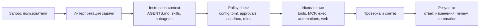

# Codex: управление субагентами, инструментами и автономной работой

> Версия файла: `v1.0`
> Дата версии: `2026-03-16`
> Тип документа: `структурированный прикладной гайд`
> Основание:
> - [codex_process_1.md](codex_process_1.md)
> - [claudecode_vs_codex.md](claudecode_vs_codex.md)
> - [agent_operating_system.md](../../autonomy/root_docs/agent_operating_system.md)
>

## О документе

Этот материал собран как прикладной гайд по `Codex` для тех, кто хочет не просто пользоваться coding agent в терминале или приложении, а осознанно управлять его поведением, автономностью и инженерной дисциплиной. Документ соединяет архитектурное объяснение `Codex` с практическими рекомендациями по настройке `config.toml`, `AGENTS.md`, `subagents`, `skills`, `rules`, `sandbox`, `MCP`, `automations`, `exec` и `SDK`.

Связанная краткая версия: [`education/root_docs/codex_managment_readme.md`](codex_managment_readme.md).

## Короткая аннотация

Этот документ представляет собой прикладной гайд по `Codex` как агентной среде разработки. В нем объясняется, как устроены `subagents`, `skills`, `tools`, `AGENTS.md`, `sandbox`, `approval_policy`, `rules`, `MCP`, а также автономные режимы работы через `Codex app`, `CLI`, `exec`, `automations` и `SDK`. Главная цель документа — показать, как превратить `Codex` из просто “умного coding assistant” в управляемую, безопасную и воспроизводимую инженерную систему, где поведение агента задается не только prompt’ом, но и конфигурацией, политиками доступа, проектными инструкциями и внешними интеграциями. Документ ориентирован на практическое применение: он помогает понять, какие механизмы в `Codex` отвечают за инструкции, какие — за безопасность, какие — за расширяемость, и как правильно комбинировать их в реальной работе.

## Расширенная аннотация

Этот документ посвящен практическому устройству `Codex` как современной агентной среды для разработки программного обеспечения. В нем последовательно разбираются ключевые механизмы, через которые пользователь может управлять поведением и автономностью агента: конфигурационные файлы `config.toml`, постоянные инструкции через `AGENTS.md`, подключаемые `skills`, специализированные `subagents`, правила выполнения shell-команд через `rules`, режимы безопасности через `sandbox` и `approval_policy`, расширение возможностей через `MCP`, а также запуск `Codex` в различных execution-сценариях — от интерактивной локальной работы до фоновых автоматизаций, CI-пайплайнов и SDK-оркестрации.

Цель документа — не просто перечислить функции платформы, а показать, как они складываются в единую управляемую архитектуру. Он помогает понять, где в `Codex` проходят реальные границы контроля: что задается на уровне мягких инструкций, что ограничивается технически, как проектировать безопасную автономную работу, когда использовать `skills`, когда — `subagents`, а когда — `rules` или `MCP`. Особое внимание уделено тому, как сделать работу с `Codex` предсказуемой, воспроизводимой и инженерно дисциплинированной: без неконтролируемого доступа к секретам, без опасных shell-действий по умолчанию, без хаотичного смешения проектных инструкций и security-политики.

По сути, это документ о том, как выстроить вокруг `Codex` полноценную операционную модель. Он будет полезен как разработчикам, которые хотят использовать `Codex` в повседневной работе с кодом, так и тем, кто собирается проектировать собственные агентные workflows, строить локальные или командные конфигурации, подключать внешние сервисы через `MCP`, использовать субагентов для распределения ролей, а также настраивать фоновую или полуавтономную работу через `exec`, `automations` и `SDK`. Документ ориентирован на прикладное применение и может служить основой как для внутреннего engineering guide, так и для публичного объяснения того, как современный coding agent должен быть устроен и управляться.

## Главные линии

Перед тем как переходить к деталям, полезно зафиксировать несколько опорных тезисов, вокруг которых построен весь документ.

1. `Codex` — это не просто “модель для кода”, а агентный runtime с несколькими слоями управления.
2. Поведение `Codex` определяется не только prompt'ом, но и `config.toml`, `AGENTS.md`, `skills`, `subagents`, `rules`, `sandbox` и `MCP`.
3. `AGENTS.md` нужен для постоянных проектных инструкций, но не должен подменять собой техническую политику безопасности.
4. `skills` лучше использовать для повторяемых workflow, а `subagents` — для отдельных ролей и изолированного контекста.
5. Реальная автономность начинается там, где настроены `approval_policy`, `sandbox_mode` и shell-правила.
6. `MCP` делает `Codex` по-настоящему расширяемым, но одновременно повышает требования к доверию и контролю.
7. Хорошая конфигурация `Codex` должна быть воспроизводимой: понятной одному человеку, переносимой между проектами и пригодной для командной работы.

## Как читать этот документ

Если вам нужно быстрое понимание системы, сначала прочитайте короткую аннотацию, главные линии и архитектурную схему. Если задача — реально настроить среду, переходите к разделам про `config.toml`, `AGENTS.md`, `skills`, `subagents`, `rules`, `sandbox` и `MCP`. Если цель — строить собственные агентные workflows, особое внимание стоит уделить разделам про `exec`, `automations`, `SDK` и модель оркестрации.

## Архитектурная схема


## Схема прохождения задачи



## Оглавление

- [Короткая аннотация](#короткая-аннотация)
- [Расширенная аннотация](#расширенная-аннотация)
- [Главные линии](#главные-линии)
- [Как читать этот документ](#как-читать-этот-документ)
- [Архитектурная схема](#архитектурная-схема)
- [Схема прохождения задачи](#схема-прохождения-задачи)
- [1. Что это за документ](#1-что-это-за-документ)
- [2. Базовая модель Codex](#2-базовая-модель-codex)
- [3. Где что хранится](#3-где-что-хранится)
- [4. Приоритет конфигурации](#4-приоритет-конфигурации)
- [5. Что реально управляет поведением Codex](#5-что-реально-управляет-поведением-codex)
- [6. Выбор модели](#6-выбор-модели)
- [7. `AGENTS.md`: слой постоянных инструкций](#7-agentsmd-слой-постоянных-инструкций)
- [8. `skills`: когда нужны и как устроены](#8-skills-когда-нужны-и-как-устроены)
- [9. `subagents`: как они устроены в Codex](#9-subagents-как-они-устроены-в-codex)
- [10. `sandbox` и approvals: где начинается реальная автономность](#10-sandbox-и-approvals-где-начинается-реальная-автономность)
- [11. `rules`: тонкая политика для shell-команд](#11-rules-тонкая-политика-для-shell-команд)
- [12. `MCP`: как расширять Codex внешними инструментами](#12-mcp-как-расширять-codex-внешними-инструментами)
- [13. `automations`: фоновая работа по расписанию](#13-automations-фоновая-работа-по-расписанию)
- [14. `codex exec`: автономный режим без UI](#14-codex-exec-автономный-режим-без-ui)
- [15. `Codex SDK`: когда нужен программный контроль](#15-codex-sdk-когда-нужен-программный-контроль)
- [16. Web, browser и формы](#16-web-browser-и-формы)
- [17. Практическая рекомендуемая схема под реальную работу](#17-практическая-рекомендуемая-схема-под-реальную-работу)
- [18. Готовый минимальный `~/.codex/config.toml`](#18-готовый-минимальный-codexconfigtoml)
- [19. Готовый минимальный `~/.codex/AGENTS.md`](#19-готовый-минимальный-codexagentsmd)
- [20. Пример custom agent](#20-пример-custom-agent)
- [21. Пример project skill](#21-пример-project-skill)
- [22. Пример rules-файла](#22-пример-rules-файла)
- [23. Что я бы не рекомендовал](#23-что-я-бы-не-рекомендовал)
- [24. Короткая карта выбора механизма](#24-короткая-карта-выбора-механизма)
- [Выводы](#выводы)
- [Источники](#источники)

## Основной гайд

Проверено по официальной документации OpenAI на `16 марта 2026`. Там, где ниже формулируются практические рекомендации, они явно отделены от документированных фактов.

## 1. Что это за документ

Этот документ объясняет, как устроен `Codex` как агентная среда разработки, а не просто как “модель в терминале”. Он описывает:
- как Codex хранит и применяет конфигурацию;
- как работают `subagents`;
- где живут `skills`;
- как устроены `AGENTS.md`;
- как управлять `sandbox`, `approval_policy` и `rules`;
- как подключать внешние инструменты через `MCP`;
- как запускать `Codex` в фоне, в CI и через SDK;
- где проходит граница между “автономной работой” и “опасным unrestricted access”.

Практическая цель документа: помочь настроить `Codex` как предсказуемого локального инженерного агента, а не как хаотичный инструмент с неясными правами.

## 2. Базовая модель Codex

По официальным docs, `Codex` существует в нескольких поверхностях:
- `Codex app`;
- `Codex CLI`;
- `IDE extension`;
- `non-interactive mode` через `codex exec`;
- `Codex SDK`.

Общая логика одна и та же:
- есть модель;
- есть системные и проектные инструкции;
- есть локальные и внешние инструменты;
- есть политики доступа;
- есть среда исполнения;
- есть дополнительные механизмы вроде `subagents`, `skills`, `MCP`, `automations`.

`Мой вывод`: Codex лучше понимать как агентный runtime. Управлять нужно не только prompt’ом, а сразу несколькими слоями:
- `config.toml`;
- `AGENTS.md`;
- `subagents`;
- `skills`;
- `rules`;
- `sandbox` и approvals;
- `MCP`;
- execution mode.

Источники:
- [Codex app](https://developers.openai.com/codex/app)
- [Codex CLI](https://developers.openai.com/codex/cli)

## 3. Где что хранится

Основные пути в Codex такие:

- глобальный конфиг: `~/.codex/config.toml`
- project config: `.codex/config.toml`
- глобальные инструкции: `~/.codex/AGENTS.md`
- глобальный override: `~/.codex/AGENTS.override.md`
- project instructions: `AGENTS.md`
- custom agents user scope: `~/.codex/agents`
- custom agents project scope: `.codex/agents`
- user skills: `$HOME/.agents/skills`
- repo skills: `.agents/skills`
- rules user scope: `~/.codex/rules`
- runtime state: `sqlite_home` в config

Это важная особенность Codex:
- `AGENTS.md` и `subagents` живут под `.codex`
- `skills` живут под `.agents/skills`

Это не ошибка. Так устроены текущие docs.

Источники:
- [Config basics](https://developers.openai.com/codex/config-basic)
- [AGENTS.md](https://developers.openai.com/codex/guides/agents-md)
- [Subagents](https://developers.openai.com/codex/subagents)
- [Skills](https://developers.openai.com/codex/skills)

## 4. Приоритет конфигурации

Codex разрешает значения по такому порядку:
1. CLI flags и `--config`
2. profile values через `--profile`
3. project `.codex/config.toml` от корня проекта к текущей директории
4. `~/.codex/config.toml`
5. system config
6. built-in defaults

Отдельно важно:
- если проект помечен как `untrusted`, project-scoped `.codex` слои пропускаются.

`Мой вывод`: это означает, что безопаснее держать глобальную политику в `~/.codex/config.toml`, а repo-specific overrides только в trusted projects.

Источник:
- [Config basics](https://developers.openai.com/codex/config-basic)

## 5. Что реально управляет поведением Codex

Поведение делится на три класса.

`Мягкое управление`
- `AGENTS.md`
- `skills`
- `developer_instructions` у subagents

Это влияет на стиль и поведение, но не является жёстким запретом.

`Жёсткое управление`
- `approval_policy`
- `sandbox_mode`
- `rules`
- `project trust`
- `MCP allowlists`
- model/tool config

Это уже реальные технические ограничения.

`Оркестрация и execution`
- interactive CLI/app
- `codex exec`
- `automations`
- `Codex SDK`
- `MCP`
- `subagents`

`Мой вывод`: если хочешь controlled autonomy, не надо пытаться решить всё одним `AGENTS.md`. Инструкции, безопасность и orchestration должны лежать в разных слоях.

## 6. Выбор модели

На странице моделей, проверенной `16 марта 2026`, OpenAI рекомендует:
- если не знаешь, с чего начать, использовать `gpt-5.4` как стартовую модель для сложного reasoning и coding;
- в Codex CLI можно переключаться между `GPT-5.4`, `GPT-5.3-Codex` и другими доступными моделями;
- `GPT-5.3-Codex` в документации описан как наиболее способная agentic coding model на текущий момент.

Практически:
- `gpt-5.4` — хороший universal default;
- `gpt-5.3-codex` — хороший выбор для coding-heavy subagents;
- reasoning effort имеет значения `minimal | low | medium | high | xhigh`.

Источник:
- [Models](https://developers.openai.com/api/docs/models)
- [GPT-5.3-Codex](https://developers.openai.com/api/docs/models/gpt-5.3-codex)
- [Codex CLI](https://developers.openai.com/codex/cli)

## 7. `AGENTS.md`: слой постоянных инструкций

Docs рекомендуют использовать `AGENTS.md` как persistent guidance layer.

Как работает discovery:
- Codex читает `~/.codex/AGENTS.md`
- затем идёт по проекту сверху вниз
- в каждой директории проверяет `AGENTS.override.md`, потом `AGENTS.md`
- можно настроить fallback filenames через `project_doc_fallback_filenames`
- общий лимит на объём инструкций задаётся `project_doc_max_bytes`

`Мой вывод`: `AGENTS.md` — это место для правил работы, а не для секретов и не для жёстких запретов.

Туда стоит класть:
- команды `test/lint/build`;
- принципы review;
- локальные conventions;
- политику по git;
- definition of done;
- список опасных зон в проекте.

Туда не стоит класть:
- абсолютные секреты;
- длинные справочники;
- глобальные shell-политики;
- то, что должно блокироваться технически.

Источник:
- [AGENTS.md](https://developers.openai.com/codex/guides/agents-md)
- [Configuration Reference](https://developers.openai.com/codex/config-reference)

## 8. `skills`: когда нужны и как устроены

По docs, skill — это папка с `SKILL.md`, плюс опционально:
- `scripts`
- `references`
- metadata

Очень важный механизм:
- skills используют `progressive disclosure`
- Codex сначала видит только metadata
- полный `SKILL.md` подгружается только когда skill реально используется

Как skill активируется:
- явно: через mention skill
- неявно: если задача совпадает с `description`

Где они живут:
- repo: `.agents/skills`
- user: `$HOME/.agents/skills`
- admin: `/etc/codex/skills`
- system: bundled skills OpenAI

`Мой вывод`:
- `skill` нужен для повторяемого workflow;
- `AGENTS.md` нужен для постоянных проектных правил;
- `subagent` нужен для отдельного контекста и отдельной роли.

Примеры хороших skills:
- `repo-onboarding`
- `release-check`
- `migration-audit`
- `incident-triage`
- `docs-scan`

Источник:
- [Skills](https://developers.openai.com/codex/skills)

## 9. `subagents`: как они устроены в Codex

По официальным docs:
- subagent workflows включены в текущих релизах по умолчанию;
- Codex спавнит subagents только если ты явно просишь об этом;
- subagents работают параллельно и возвращают агрегированный результат;
- subagents inherit current sandbox policy;
- live runtime overrides вроде `/approvals` или `--yolo` тоже переносятся в child threads.

Built-in agents:
- `default`
- `worker`
- `explorer`

Custom agents:
- user scope: `~/.codex/agents`
- project scope: `.codex/agents`

Формат custom agent — standalone TOML. Минимально обязательны:
- `name`
- `description`
- `developer_instructions`

Можно добавлять:
- `model`
- `model_reasoning_effort`
- `sandbox_mode`
- `mcp_servers`
- `skills.config`
- `nickname_candidates`

Глобальные лимиты:
- `agents.max_threads`
- `agents.max_depth`
- `agents.job_max_runtime_seconds`

По docs defaults:
- `agents.max_threads = 6`
- `agents.max_depth = 1`

`Мой вывод`:
- subagents — это лучший механизм для parallel exploration и разделения ролей;
- их стоит делать узкими и opinionated;
- не надо делать одного “универсального мега-агента”.

Источник:
- [Subagents](https://developers.openai.com/codex/subagents)
- [Configuration Reference](https://developers.openai.com/codex/config-reference)

## 10. `sandbox` и approvals: где начинается реальная автономность

Ключевые поля:
- `approval_policy`
- `sandbox_mode`

Значения `approval_policy`:
- `untrusted`
- `on-request`
- `never`
- либо объект `reject = { ... }`

Значения `sandbox_mode`:
- `read-only`
- `workspace-write`
- `danger-full-access`

Важный факт из docs:
- `--full-auto` = `--sandbox workspace-write --ask-for-approval on-request`

То есть `--full-auto` — это не полный беспредел. Это middle ground:
- читать файлы;
- править внутри workspace;
- запускать команды в workspace;
- но спросить approval для некоторых действий вне него или при доступе к сети.

Отдельно docs предупреждают:
- `danger-full-access` и bypass approvals — это режим повышенного риска;
- в writable roots `.git`, `.agents`, `.codex` защищены как read-only.

`Мой вывод`:
- безопасный default — `workspace-write + on-request`
- для анализа — `read-only`
- `danger-full-access` только в изолированной среде или под осознанный риск

Источники:
- [Agent approvals & security](https://developers.openai.com/codex/agent-approvals-security)
- [Configuration Reference](https://developers.openai.com/codex/config-reference)

## 11. `rules`: тонкая политика для shell-команд

`rules` — это отдельный механизм для управления тем, какие команды можно запускать без prompt.

Главный примитив — `prefix_rule()`.

У `prefix_rule()` есть:
- `pattern`
- `decision`
- `justification`
- `match`
- `not_match`

Решения:
- `allow`
- `prompt`
- `forbidden`

Docs отдельно поясняют:
- если несколько правил совпали, применяется наиболее жёсткое
- для `bash -lc`, `zsh -c` и похожих wrapper-команд Codex пытается разбирать линейные цепочки команд и применять rules к ним

`Мой вывод`: `rules` — это не замена sandbox. Это surgical control для конкретных class of commands.

Хорошие use cases:
- `git push` всегда `prompt`
- `gh pr view` всегда `allow`
- `rm -rf ` всегда `forbidden`
- `kubectl apply` всегда `prompt`
- `terraform destroy` всегда `forbidden`

Источник:
- [Rules](https://developers.openai.com/codex/rules)

## 12. `MCP`: как расширять Codex внешними инструментами

По docs, Codex поддерживает:
- `STDIO` MCP servers
- `Streamable HTTP` MCP servers
- bearer token auth
- OAuth auth

MCP можно настроить:
- через `codex mcp add ...`
- или напрямую в `config.toml`

MCP нужен, чтобы дать Codex доступ к:
- документации
- браузеру
- Figma
- GitHub
- внутренним API
- базе знаний
- другим dev tools

Ключевые поля `mcp_servers.<id>`:
- `command`
- `args`
- `env`
- `env_vars`
- `cwd`
- `url`
- `enabled_tools`
- `required`
- `startup_timeout_sec`
- `tool_timeout_sec`

`Мой вывод`: если тебе нужен “настоящий агент”, а не просто local editor bot, то `MCP` — это главный механизм расширения.

Источник:
- [MCP](https://developers.openai.com/codex/mcp)
- [Configuration Reference](https://developers.openai.com/codex/config-reference)

## 13. `automations`: фоновая работа по расписанию

Docs описывают `automations` так:
- они работают в фоне в `Codex app`
- app должен быть запущен
- проект должен быть доступен на диске
- в git-репозитории automation можно запускать:
  - в local project
  - в отдельном `worktree`

Это важный tradeoff:
- local project automation может менять ваш рабочий checkout
- worktree automation изолирует изменения от незавершённой локальной работы

Docs также говорят:
- automations используют ваши default sandbox settings
- их можно комбинировать со skills
- можно явно вызывать skill через `$skill-name`

`Мой вывод`:
- для audit/review/reporting лучше worktree
- для harmless housekeeping можно local
- опасные automation без sandbox и без правил запускать не стоит

Источник:
- [Automations](https://developers.openai.com/codex/app/automations)

## 14. `codex exec`: автономный режим без UI

Если нужен CI, scriptable режим или pipeline, docs рекомендуют `codex exec`.

Когда использовать:
- CI jobs
- scheduled runs
- scripted repo analysis
- machine-readable outputs
- two-stage pipelines

Важные возможности:
- `codex exec --json` даёт JSONL stream событий
- `--output-schema` позволяет требовать structured final output
- можно `resume` прошлую non-interactive session
- по умолчанию `codex exec` идёт в read-only sandbox
- для edit mode можно использовать `--full-auto`
- для большего доступа — `--sandbox danger-full-access`, но docs советуют делать это только в controlled environment

`Мой вывод`: `codex exec` — это правильный способ автоматизировать Codex в shell/CI. Не надо пытаться скриптовать интерактивную TUI.

Источник:
- [Non-interactive mode](https://developers.openai.com/codex/noninteractive)

## 15. `Codex SDK`: когда нужен программный контроль

Если `codex exec` уже тесен, docs предлагают `Codex SDK`.

Текущий подтверждённый путь:
- TypeScript library: `npm install @openai/codex-sdk`
- Node.js `18+`
- можно создавать thread, запускать `run()`, потом продолжать или resume по `thread_id`

`Мой вывод`:
- `codex exec` — для shell pipelines
- `Codex SDK` — для server-side orchestration и собственных agent workflows

Практически это означает ещё одну важную вещь:
когда `Codex` доходит до `exec` и `SDK`, он перестаёт быть "инструментом внутри терминала" и начинает жить на уровне ОС как процесс, сервис или оркестратор.
По архитектурной логике это тот же класс автономности, который для `Claude Code` подробно разобран в [agent_os_autonomy.md](../../autonomy/root_docs/agent_os_autonomy.md):
терминал — это интерфейс входа, а не место существования агентной организации.

Источник:
- [Codex SDK](https://developers.openai.com/codex/sdk)

## 16. Web, browser и формы

Нужно различать три уровня.

`Web search`
- это поиск и чтение веб-данных
- управляется настройкой `web_search`
- варианты: `cached`, `live`, `disabled`

`MCP browser/devtools tools`
- это путь для интеграции браузерных инструментов в Codex

`Computer use`
- это отдельный tool в OpenAI API
- он работает через цикл `computer_call -> execute -> screenshot -> continue`
- подходит для кликов, ввода текста, скролла, форм

`Мой вывод`:
- если нужен просто up-to-date context, хватает `web_search`
- если нужен browser tooling в Codex, смотри `MCP`
- если нужен настоящий UI automation с кликами и вводом, смотри `computer use`

Источники:
- [Config basics](https://developers.openai.com/codex/config-basic)
- [MCP](https://developers.openai.com/codex/mcp)
- [Computer use](https://platform.openai.com/docs/guides/tools-computer-use)

## 17. Практическая рекомендуемая схема под реальную работу

Я бы рекомендовал такой стек.

1. Глобальный `~/.codex/config.toml`
- default model
- approvals
- sandbox
- web search
- agents limits
- MCP defaults

2. Глобальный `~/.codex/AGENTS.md`
- личные рабочие соглашения
- код-стиль в части поведения агента
- git policy
- validation policy

3. Project `AGENTS.md`
- build/test/lint commands
- архитектурные ограничения
- risky areas
- project-specific expectations

4. User agents в `~/.codex/agents`
- reviewer
- debugger
- docs researcher
- refactor planner

5. Repo skills в `.agents/skills`
- onboarding
- release-check
- migration-audit
- incident-triage

6. Rules в `~/.codex/rules/default.rules`
- `git push` prompt
- destructive ops forbidden
- safe read-only commands allow

7. MCP только для доверенных серверов

## 18. Готовый минимальный `~/.codex/config.toml`

```toml
model = "gpt-5.4"
model_reasoning_effort = "medium"
approval_policy = "on-request"
sandbox_mode = "workspace-write"
web_search = "cached"

[agents]
max_threads = 4
max_depth = 1

[sandbox_workspace_write]
network_access = false

# Пример: отдельная модель для /review
review_model = "gpt-5.3-codex"

# Пример: отключить конкретный skill
[[skills.config]]
path = "/Users/you/.agents/skills/legacy-skill"
enabled = false
```

Что это даёт:
- хороший default reasoning/coding режим;
- агент может работать внутри workspace;
- сеть по умолчанию закрыта;
- review можно пустить через coding-specialized model;
- subagents ограничены по числу и глубине.

## 19. Готовый минимальный `~/.codex/AGENTS.md`

```md
## Working agreements

- Prefer small, reviewable diffs.
- Read relevant files before editing.
- Run the smallest useful validation after code changes.
- Ask before adding dependencies or changing public interfaces.
- Do not rewrite git history unless explicitly requested.
- Findings first in code review.
- Prioritize correctness, regressions, security, and missing tests.
```

Это хороший global baseline.  
Project-specific детали лучше класть в `AGENTS.md` внутри репозитория.

## 20. Пример custom agent

Путь: `~/.codex/agents/reviewer.toml`

```toml
name = "reviewer"
description = "Review diffs for correctness, regressions, security issues, and missing tests."
developer_instructions = """
Review code like an owner.
Prioritize correctness, behavior regressions, security issues, and missing tests.
Do not rewrite code. Return findings first, ordered by severity.
"""
model = "gpt-5.3-codex"
model_reasoning_effort = "high"
sandbox_mode = "read-only"
nickname_candidates = ["Atlas", "Delta", "Echo"]
```

Почему это хорошо:
- агент узкий;
- не пишет код;
- работает в read-only;
- использует coding-specialized model.

## 21. Пример project skill

Путь: `.agents/skills/release-check/SKILL.md`

```md
---
name: release-check
description: Use before tagging or publishing a release. Checks versioning, changelog, docs, tests, and git state.
---

Run a release readiness check.

Return:
1. current version source
2. changelog status
3. install docs status
4. test status
5. git cleanliness
6. blockers
7. exact next steps

Do not push, publish, or create a tag.
```

Почему это лучше skill, а не subagent:
- это повторяемый workflow;
- он полезен во многих turns;
- ему не нужен отдельный агентный контекст по умолчанию.

## 22. Пример rules-файла

Путь: `~/.codex/rules/default.rules`

```rules
prefix_rule(
  pattern = ["git", "push"],
  decision = "prompt",
  justification = "Pushes should remain manual.",
  match = ["git push origin main"]
)

prefix_rule(
  pattern = ["gh", "pr", "view"],
  decision = "allow",
  justification = "Viewing pull requests is safe.",
  match = ["gh pr view 123"]
)

prefix_rule(
  pattern = ["rm", "-rf", "/"],
  decision = "forbidden",
  justification = "Never delete the filesystem root.",
  match = ["rm -rf /"]
)
```

Это не заменяет sandbox. Это слой точечной shell-политики.

## 23. Что я бы не рекомендовал

- не держать всё в одном `AGENTS.md`
- не включать `danger-full-access` как default
- не разрешать `git push` и cloud CLIs без prompt
- не делать одного “универсального subagent”
- не складывать личные secrets в repo config
- не подключать недоверенные MCP servers
- не использовать local-project automations там, где нужен isolation

## 24. Короткая карта выбора механизма

Используй:
- `AGENTS.md`, если правило должно постоянно действовать в проекте
- `skill`, если нужен повторяемый workflow
- `subagent`, если нужен отдельный контекст и отдельная роль
- `rules`, если нужно контролировать shell-команды
- `sandbox` и `approval_policy`, если нужно реально ограничивать действия
- `MCP`, если нужен внешний инструмент или внешний контекст
- `codex exec`, если нужен CI/script mode
- `Codex SDK`, если нужен программный orchestration layer
- `computer use`, если нужен настоящий UI automation

## Выводы

1. `Codex` становится по-настоящему мощным тогда, когда используется как агентный runtime с явной архитектурой управления.
2. Ключ к управляемой автономности в `Codex` лежит в правильном сочетании `config.toml`, `AGENTS.md`, skills, subagents, rules и sandbox-политики.
3. `Skills` и `subagents` решают разные задачи: первые упаковывают повторяемые workflow, вторые дают изолированные роли и отдельный контекст.
4. `MCP`, `exec`, `automations` и `SDK` резко расширяют возможности `Codex`, но одновременно требуют более строгого контроля над доступом, доверием и execution boundaries.
5. Хорошая конфигурация `Codex` должна быть не только удобной, но и воспроизводимой: понятной одному человеку, переносимой между проектами и пригодной для дальнейшей автоматизации.

## Источники
- [Codex app](https://developers.openai.com/codex/app)
- [Codex CLI](https://developers.openai.com/codex/cli)
- [Config basics](https://developers.openai.com/codex/config-basic)
- [Configuration Reference](https://developers.openai.com/codex/config-reference)
- [AGENTS.md](https://developers.openai.com/codex/guides/agents-md)
- [Subagents](https://developers.openai.com/codex/subagents)
- [Skills](https://developers.openai.com/codex/skills)
- [Rules](https://developers.openai.com/codex/rules)
- [MCP](https://developers.openai.com/codex/mcp)
- [Agent approvals & security](https://developers.openai.com/codex/agent-approvals-security)
- [Automations](https://developers.openai.com/codex/app/automations)
- [Non-interactive mode](https://developers.openai.com/codex/noninteractive)
- [Codex SDK](https://developers.openai.com/codex/sdk)
- [Models](https://developers.openai.com/api/docs/models)
- [GPT-5.3-Codex](https://developers.openai.com/api/docs/models/gpt-5.3-codex)
- [Computer use](https://platform.openai.com/docs/guides/tools-computer-use)
